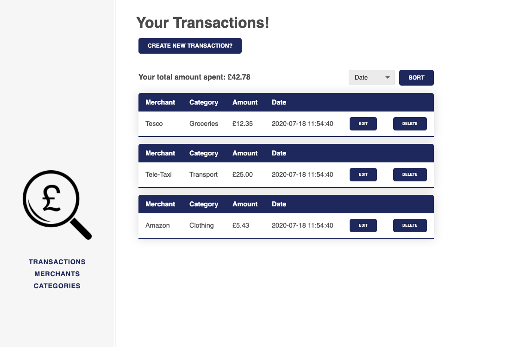

# Spending Tracker



---

### Table of Contents

- [Description](#description)
- [How To Use](#how-to-use)
- [References](#references)

---

## Description

Spending Tracker is a spending management system 
written in Ruby. The back end is built on Sinatra and PostgreSQL utilising RESTful API design. 

The application allows users to track their daily expenditure, while keeping tabs on varying merchants and shopping categories.

In the future, I am planning on revisiting this project to implement JS charts, so the that the user can see their transaction information displayed via dynamic chart.

#### Technologies

- Ruby
- HTML
- CSS
- Sinatra
- PostgreSQL

[Back To The Top](#spending-tracker)

---

## How To Use

#### Installation


##### Terminal commands to create SQL database and tables:

```
dropdb spending_tracker
```

```
createdb spending_tracker
```

```
psql -d spending_tracker -f db/spending_tracker.sql
```

##### Command to populate tables:

```
ruby db/seeds.rb
```

##### Command to run the server:

```
ruby app.rb
```
[Back To The Top](#spending-tracker)

---

## References

- [Sinatra Docs](http://sinatrarb.com/documentation.html)
- [PostgreSQL Docs](https://www.postgresql.org/docs/) 


[Back To The Top](#pokedex)
